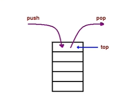
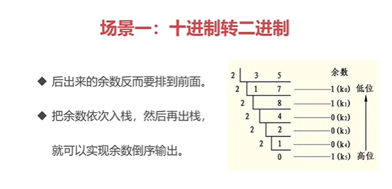
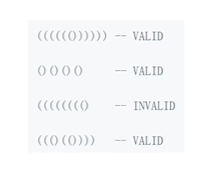
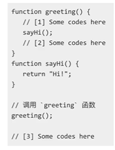

数据结构：计算机存储，组织数据的方法  
算法：一系列解决问题的指令，就像食谱  
栈 队列 链表  
集合 字典  
树 堆 图   
### 栈
后进先出的结构   
场景: 十进制转二进制 判断字符串的括号是否有效 函数调用堆栈
  
 判断括号是否是被闭合 判断左右括号，遇到左括号就入栈，遇到右括号就出栈，最后判断栈的长度
  
栈 后进先出的结构
### 队列
先进先出的结构 
食堂排队打饭 异步中的任务队列 计算最近请求次数 