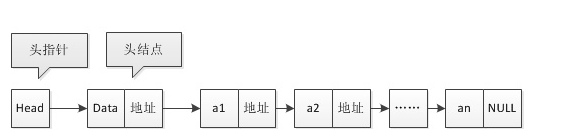
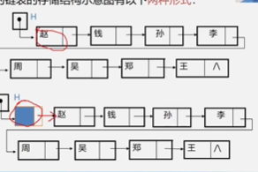

- 链式存储结构
- 数据域，指针域

结点，链表  
单链表，双链表，循环链表  
结点有两个指针域，一个指向后继元素，一个指向前驱元素  
首尾相接的链表称为循环列表  
头指针 指向第一个元素的指针  
头结点 方便操作设立的，一般没意义

1. 不带头结点的单链表 
2. 带头结点

如何表示空表？ 不带头结点的 head === null 带头结点的 head.next === null

为什么要加头结点？ 处理首元结点的时候会有方便 便于空表和非空表的统一处理 

链表顺序存储法  随机存取 顺序存取 从头上开始向后找 

单链表由表头唯一确定，因此单链表可以用头指针的名字来命名，若单链表的名为L,就可以称作表L

js定义node结点  
```typescript
function Node(element){
    this.element = element,
    this.next = null
}
```
存储学生的学号，姓名，成绩
```javascript
function Student(...value){
    const {name,id,credit} = value
    this.name = name
    this.id = id
    this.credit = credit
    this.next = null
}
```
单链表的操作的实现  
单链表的初始化
见文件linkedList.js  

判断链表是否为空

此时我发现，js作为一门脚本语言，无法完美的模拟各种练习，写的也总是模棱两可，于是我打算花一周的时候学习go，掌握go的语法，回来接着来练习算法